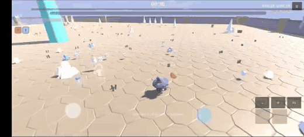

# HordeSurvival 3D

<p align="center">
  
</p>

A stylized third-person survival roguelite for the browser. Survive increasingly dangerous hordes, auto-attack weapons, collect XP, choose powerful upgrades, evolve weapons, fight elites and a phased boss — and build increasingly broken runs.

## Gameplay — Version 2

<p align="center">
  
</p>

<p align="center">
  <a href="ScreenShots/ScreenRecord%2001%20v2.0.0.mp4">Full video with audio (MP4)</a>
</p>

## تصاویری از محیط بازی ورژن 1

Game environment images from version 1.

<p align="center">
  <table>
    <tr>
      <td></td>
      <td></td>
    </tr>
  </table>
</p>

**Play:** https://mohsen-niksirat.github.io/Horde_Survival_3D_Godot/ (after Pages is enabled)

Inspired by the gameplay philosophy of [HordeSurvival (Android)](https://github.com/mohsen-niksirat/HordeSurvival), rebuilt from scratch as an independent Godot 4 project.

## Features

- Third-person 3D arena combat, camera-relative movement, zero aiming
- **Standard run: survive 15 minutes for VICTORY** — or toggle **Endless** for infinite scaling
- 6 auto-firing weapons (incl. Void Lance) + 5 evolutions (Hellfire, Holy Bible, Aurora, Judgment, Thunderstorm)
- 7 weapon synergies + relic synergy hooks (Inferno Band, Favored Fortune, Mobile Bulwark)
- 9 enemy archetypes + 8 modular elite abilities + one complete 3-phase boss
- Character unlocks: Mage free, Paladin (1 win), Rogue (3 wins)
- XP orbs with magnet pickup, level-ups with 3 rarity-colored choices, 8 passive items
- Relics (rarity-weighted map pickups incl. Phoenix Feather revive), a pet (Dragon Welp), 2 active abilities (Meteor Strike, Time Freeze)
- Combo system with XP multiplier (capped) and 6 visual tiers, 12 achievements with gold rewards
- Threat-budget horde spawning, difficulty timeline, quality-tier entity caps
- Versioned meta save (gold, bests, wins, unlocks, achievements) that persists in the browser
- Responsive HUD (boss HP bar with phase tint, ability cooldowns); virtual joystick + touch camera
- Settings: UI scale, reduced VFX, damage numbers, quality tiers, screen shake
- Kenney CC0 GLB heroes/enemies/weapons/skybox (see docs/ASSET_CREDITS.md); quality Very Low→Ultra + FPS counter

## Win / Unlock Roadmap

| Goal | Reward |
|---|---|
| Survive 15 min | VICTORY + 250 gold |
| 1 win | Unlock **Paladin** |
| 3 wins | Unlock **Rogue** |
| Achievements | Bonus gold (see in-game list) |

## Recent polish (R/S/T series)

- 15-minute victory ending + endless mode
- Void Lance → **Void Reaver** evolution, Hunter's Mark passive, extra synergies
- Character unlocks by wins, achievements panel (14), victory gold + interest
- Live boss HP bar, enrage aura, fan flash, elite rings/bursts/warnings
- Victory fanfare, combo tier toasts, phoenix revive toast
- Meta shop: 8 upgrades including Bulwark + Precision
- XP shard value tiers (gold = big XP), relic beacons, rarity toasts
- HUD win countdown, run phase, NEW BEST TIME, pause run stats

## How to Run Locally

1. Install [Godot 4.7+](https://godotengine.org/download) (project features pin `4.7`)
2. Open `project.godot` in the Godot editor
3. Press **F5** (Play)

## How to Export Web

1. In Godot: **Project → Export → Web** (preset included in `export_presets.cfg`)
2. Ensure the Web export templates are installed (Editor → Manage Export Templates)
3. Export to `build/web/index.html`

Or use the CI workflow (below) which does this automatically.

## How to Deploy to GitHub Pages

Deployment is automated via GitHub Actions (`.github/workflows/deploy-web.yml`):

1. Push to `main`
2. Enable **Settings → Pages → Source: GitHub Actions** (one time)
3. The workflow builds the Web export and deploys it to Pages

Manual URL after setup: `https://mohsen-niksirat.github.io/Horde_Survival_3D_Godot/`

## How to Export Android (future)

Architecture is Android-compatible (Compatibility renderer, touch-first input abstraction). Android export steps will be added post-MVP: install Android build template (`Project → Install Android Build Template`), add the Android preset, export APK/AAB.

## Controls

| Action | Desktop | Mobile | Gamepad |
|---|---|---|---|
| Move | WASD / Arrows | Left virtual joystick | Left stick |
| Camera | Mouse (captured) / Arrow keys | Right touch drag | Right stick |
| Ability 1 (Meteor) | Q | Button | Trigger |
| Ability 2 (Freeze) | E | Button | Trigger |
| Fullscreen toggle | F11 or Alt+Enter | FS button (next to zoom) | — |
| Pause | Esc | — | Start |
| Debug overlay | F3 | — | — |

## Architecture Overview

```
scenes/  bootstrap · main · menu · world · player · enemies · weapons · bosses · pickups · ui
scripts/ core · player · combat · enemies · spawning · weapons · abilities · items ·
         progression · save · input · audio · performance · utilities
data/    weapons · enemies · passives · relics · abilities (all .tres data-driven)
web/     custom HTML shell (loading bar, Click-to-Play, WebGL fallback)
tests/   headless smoke + phase test suites (godot --headless --script tests/<t>.gd)
```

Key systems:
- **Autoloads**: EventBus (signal hub), RunManager (run session), GameManager (state machine), InputManager (platform abstraction), PoolManager (deferred-release pooling), SaveManager (versioned JSON), AudioManager (procedural SFX), PerformanceManager (quality tiers + caps)
- **Per-run**: WaveManager (threat budget), EnemyManager (registry + queries), ProgressionManager (level-ups/evolutions), RelicSystem, ComboManager, AchievementSystem, AbilityController
- **Data-driven**: all content lives in `.tres` resources — new enemies/weapons/relics = new resource files
- **Combat pipeline**: single DamageEvent flow (crit → armor → status → death → loot → combo → achievements)

## Development

Phased development per `docs/ROADMAP.md`; design rationale in `docs/GAME_DESIGN.md`, `docs/ARCHITECTURE.md`, and reference analysis in `docs/EXISTING_GAME_ANALYSIS.md`.

Run all headless tests:

```powershell
godot --headless --path . --script res://tests/smoke_phase1.gd   # (and test_phase2..10)
```
